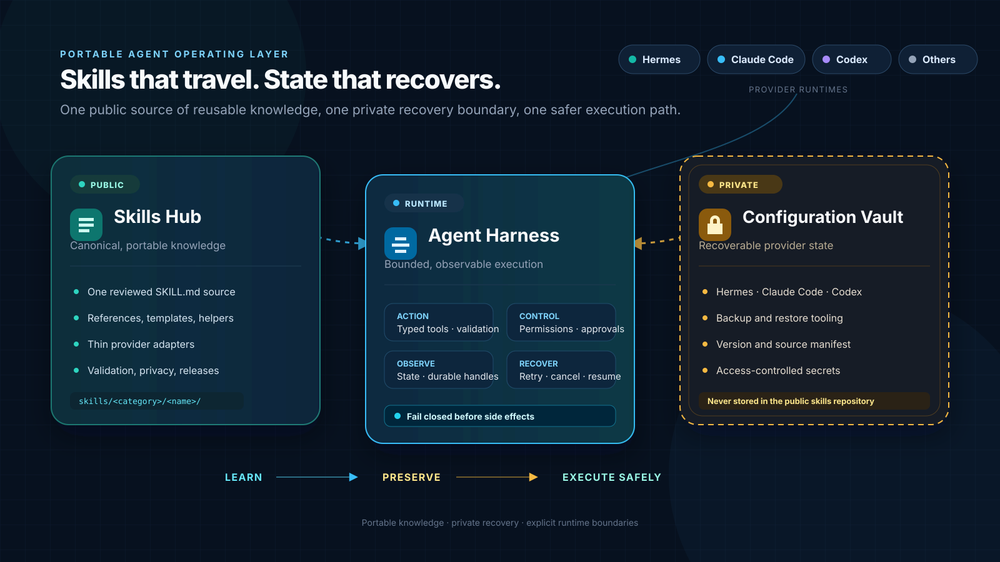

# Shared Agent Skills

**A portable operating layer for AI agents: shared skills, recoverable configuration, and safer execution harnesses.**

Generated with `quokkify/project-toolkit` at `v2.12.1`. Run `copier update` to apply future template changes; Renovate updates workflow version references independently.



The project is built around one idea: an agent should be able to **learn once, move between providers, recover its setup, and execute through explicit safety boundaries**.

> **Learn → Preserve → Execute safely**

## The Ecosystem

### 1. Skills Hub

This repository is the public, canonical source for reusable workflows. Every portable skill lives once under [`skills/`](skills) and can be consumed by **Hermes**, **Claude Code**, **Codex**, or another compatible agent without maintaining provider-specific copies.

- portable `SKILL.md` packages;
- references, templates, and deterministic helper scripts;
- review and promotion workflows for reusable lessons;
- validation, privacy checks, and release automation.

### 2. Private Configuration Vault

Agent state and provider configuration need a different trust boundary. The wider project architecture therefore keeps backups in a **separate private vault**, with restore scripts and a version/source manifest for Hermes, Claude Code, Codex, and future providers.

The vault is intentionally **not part of this public repository**. Secrets, memories, transcripts, runtime databases, machine-specific settings, and raw agent-home snapshots must never be promoted here. See [Project Architecture](docs/project-architecture.md) for the boundary and recovery model.

### 3. Agent Harness

Skills describe *how to work*; a harness controls *how work is executed*. The harness layer connects agent runtimes to typed tools, validation, permissions, observations, approval gates, retries, and recovery contracts.

The included [`agent-harness-design`](skills/orchestration/agent-harness-design/SKILL.md) skill captures the design principles: make correct actions easy to express, unsafe actions hard to invoke accidentally, and failures easy to diagnose.

## What Exists Today

| Layer | Status | Where it lives |
| --- | --- | --- |
| Portable skill hub | Available | [`skills/`](skills) |
| Provider adapters | Available | [`adapters/`](adapters) |
| Harness design guidance | Available | [`agent-harness-design`](skills/orchestration/agent-harness-design/SKILL.md) |
| Validation and safe synchronization | Available | [`scripts/`](scripts), [`tests/`](tests), CI |
| Private configuration backup vault | Separate deployment | Deliberately outside this public repository |

## Repository Layout

```text
skills/
├── <category>/<skill-name>/SKILL.md     # canonical entry point
├── <category>/<skill-name>/references/ # supporting guidance
├── <category>/<skill-name>/scripts/    # deterministic helpers
└── <category>/<skill-name>/templates/  # reusable templates

adapters/
├── claude/README.md         # Claude Code connection notes
├── codex/AGENTS.md          # optional Codex project instructions
└── hermes/                  # Hermes configuration example

docs/                        # architecture, catalog, and guides
scripts/                     # install, validation, and safe-sync helpers
tests/                       # dependency-free regression tests
```

`skills/` is the only source of truth for portable skills. Tool-specific configuration belongs in `adapters/`; private runtime state belongs in the separate vault. Claude Code discovers project skills from `.claude/skills`, while Codex uses `.agents/skills`—not `.codex/skills`.

## Quick Start

Clone the repository:

```bash
git clone https://github.com/quokkify/skills.git
cd skills
```

### Claude Code

```bash
npx skills add quokkify/skills --skill '*' -g -a claude-code -y
```

Claude Code needs no copied global adapter. Agent personas, output styles, status lines, and project-specific commands remain user- or project-owned.

### Codex

```bash
npx skills add quokkify/skills --skill '*' -g -a codex -y
```

Optionally copy the shared project instructions into a target repository:

```bash
./scripts/install-codex-agents.sh /path/to/your/project
```

### Hermes

Point Hermes directly at the canonical skill directory:

```yaml
skills:
  external_dirs:
    - /absolute/path/to/skills/skills
```

The same example is available at [`adapters/hermes/config.example.yaml`](adapters/hermes/config.example.yaml). Start a new Hermes session after changing the discovery path. A same-named profile-local skill can take precedence over the shared copy, so keep shared changes on an isolated Git branch or worktree.

## Browse the Hub

The repository currently contains **19 portable skills** spanning:

- orchestration and agent recovery;
- skill lifecycle and promotion;
- repository safety and quality gates;
- software development and browser QA;
- infrastructure operations;
- game troubleshooting and source reconnaissance.

Browse the complete [Skill Catalog](docs/skill-catalog.md) or open the [documentation site](https://quokkify.github.io/skills/).

## Update a Shared Checkout

From a clean checkout on `main`:

```bash
./scripts/sync-shared-skills.sh
```

The helper fetches only `origin/main`, validates the exact fetched snapshot with the currently trusted validator, allows fast-forward updates only, disables Git hooks during branch movement, and rejects concurrent checkout changes. It never executes scripts from the fetched tree.

Copied Codex adapter files are not refreshed by this command. Rerun the installer when `adapters/codex/AGENTS.md` changes.

## Validate Changes

Run the portable CI-equivalent gate:

```bash
./scripts/validate.sh --ci
```

Run the complete local gate, including full-history Gitleaks scanning:

```bash
./scripts/validate.sh --full
```

Gitleaks `8.30.1` or newer must be available on `PATH` or through `GITLEAKS_BIN` for `--full`.

## Update Project Scaffolding

The repository records its `quokkify/project-toolkit` template source and answers in [`.copier-answers.yml`](.copier-answers.yml). From a clean checkout, review and apply template updates with:

```bash
copier update --trust
```

Repository-specific validation remains in `scripts/validate.sh`; the generated update contract and reusable CI workflow keep shared project plumbing versioned without replacing that custom gate.

Optional repository-local Git hooks:

```bash
./scripts/install-git-hooks.sh
```

The validator checks skill layout and frontmatter, duplicate names, Markdown links, symlinks, machine-specific paths, and public/private boundaries.

## Security Boundary

This is a public repository. Do not commit credentials, memories, transcripts, sessions, runtime databases, private project context, machine-specific configuration, or backup archives. Read [SECURITY.md](SECURITY.md) before promoting locally generated material.

Every pull request runs repository validation and Gitleaks. Scanner success complements manual privacy review; it does not prove that content is appropriate to publish.

## Documentation

- [Project architecture](docs/project-architecture.md)
- [Quick start](docs/quick-start.md)
- [Skill catalog](docs/skill-catalog.md)
- [Using the skills](docs/guides/how-to-use-skills.md)
- [Reviewing and promoting skills](docs/guides/reviewing-and-promoting-skills.md)
- [Releases and dependency updates](docs/guides/releases-and-dependencies.md)
- [FAQ](docs/FAQ.md)
- [Third-party notices](THIRD_PARTY_NOTICES.md)
