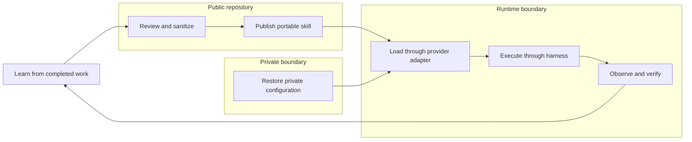

# Project Architecture

The project treats agent portability as three connected problems: reusable knowledge, recoverable private state, and safe execution.

## :material-bookshelf: Skills Hub

**Public and portable.** The canonical `skills/` tree stores reviewed workflows once, while adapters connect provider-specific discovery mechanisms and supply genericized global templates.

- versioned skill packages;
- references, templates, and helpers;
- runtime-neutral global instruction base and lifecycle hooks in `adapters/shared/`;
- per-runtime wiring templates in `adapters/claude/` and `adapters/codex/`;
- privacy-aware promotion through pull requests;
- validation and release gates.

## :material-shield-lock: Configuration Vault

**Private and recoverable.** A separate vault preserves the real configuration overlay and a restore manifest without weakening the public boundary.

- employer conventions, project trust lists, credentialed MCP servers, private skills;
- machine-specific Hermes, Claude Code, and Codex configuration;
- the overlay merged over the public templates at install time;
- backup and restore tooling;
- repository URL, exact revision, and dirty-state manifest;
- encrypted or access-controlled secret storage.

## :material-robot-industrial: Agent Harness

**Bounded and observable.** The harness turns skills into safe runtime behavior by controlling the tools and feedback exposed to an agent.

- typed operations and fail-closed validation;
- least-privilege permissions and approval gates;
- deterministic observations and durable handles;
- cancellation, retries, recovery, and audit evidence.

## Trust Boundaries

The three layers cooperate, but they do not share the same publication or security policy.

| Data | Public Skills Hub | Private Vault | Runtime Harness |
| --- | :---: | :---: | :---: |
| Portable workflows and generic references | Yes | Optional manifest reference | Read-only consumption |
| Provider connection instructions | Sanitized examples only | Full private configuration | Loaded at runtime |
| Global instruction base, hook scripts, settings and subagent definitions | Genericized templates only | Real overlay values | Merged result loaded at runtime |
| Employer identifiers, project trust lists, machine paths, pinned personal model choices | **Never** | Owned here | Applied at runtime |
| Credentials and private keys | **Never** | Encrypted/access-controlled | Injected without model-visible logging |
| Memories, chats, sessions, runtime databases | **Never** | Backup only when explicitly selected | Scoped runtime access |
| Tool schemas and safety contracts | Yes | Not required | Enforced |

!!! danger "The vault is not a directory inside this repository"
    A public clone, Git history, release artifact, or documentation build must never contain raw agent-home snapshots, credentials, memories, transcripts, or private runtime state.

    Publishing a global adapter *template* does not relax this. A template is derived from a real setup by removing everything specific to it; it is never a copy of one. `scripts/validate_repo.py` mechanically rejects machine home paths, local secret-store paths, forbidden state filenames, private state directories, and symlinks, but a passing validator is not a substitute for reading the diff.

## Lifecycle

This creates a controlled feedback loop:

1. **Learn** from real work.
2. **Sanitize and review** the reusable lesson.
3. **Publish** it once in the hub.
4. **Preserve** private provider state separately.
5. **Execute safely** through a bounded harness.
6. **Verify** results before the next lesson is promoted.

## Current Repository Scope

This repository implements the public skills hub, provider adapters including genericized global templates, validation/synchronization tooling, and reusable harness-design guidance. The private overlay and configuration vault is an architectural companion, not a public package shipped here. A merging installer for the templates is planned and not yet shipped.

Use these entry points:

- [Quick Start](quick-start.md) — connect Claude Code, Codex, or Hermes.
- [Decision Records](adr/index.md) — why the global-adapter boundary moved.
- [Skill Catalog](skill-catalog.md) — browse the portable workflows.
- [How to Use These Skills](guides/how-to-use-skills.md) — understand provider discovery and adapter behavior.
- [`agent-harness-design`](skill-catalog.md#orchestration) — design safe tool and observation contracts.
- [`agent-knowledge-lifecycle`](skill-catalog.md#skill-management) — maintain the public/private knowledge boundary.
